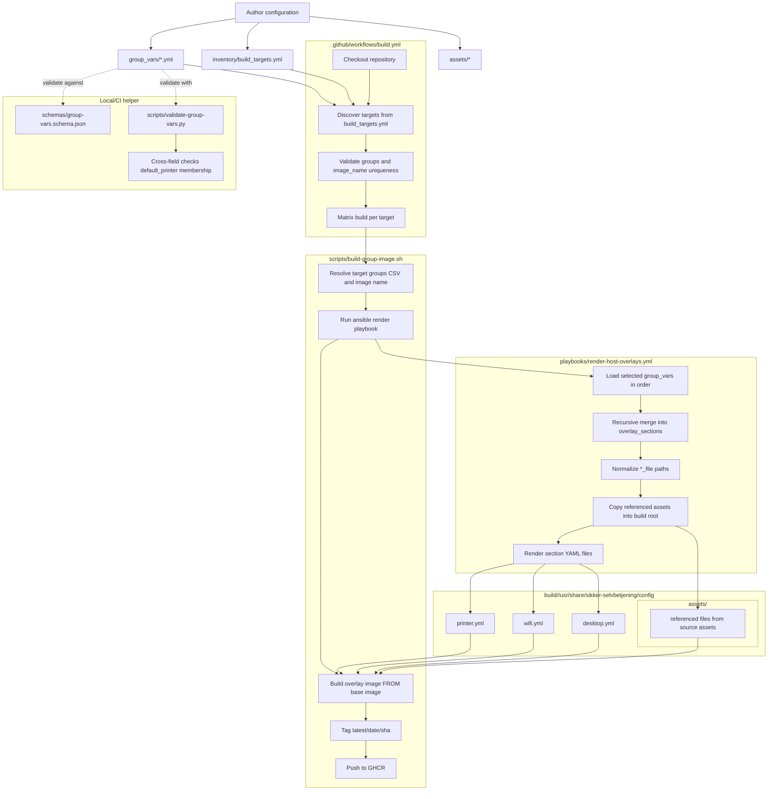

# sikker-selvbetjening-config

This repository defines configuration overlays per target/site and builds per-target container images based on `ghcr.io/bibsdb/sikker-selvbetjening`.

## Process and Flow

## Key Paths

- Group overlays: `group_vars/`
- Build target matrix input: `inventory/build_targets.yml`
- Overlay renderer: `playbooks/render-host-overlays.yml`
- Build and push script: `scripts/build-group-image.sh`
- Optional cross-field validator: `scripts/validate-group-vars.py`
- Schema definitions: `schemas/`
